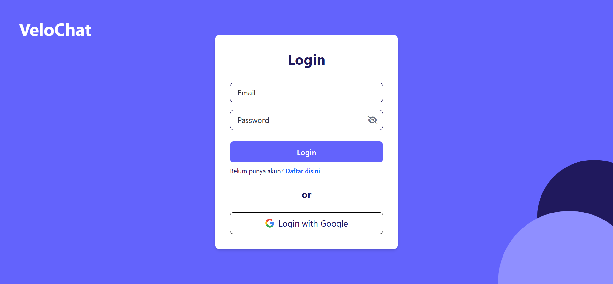
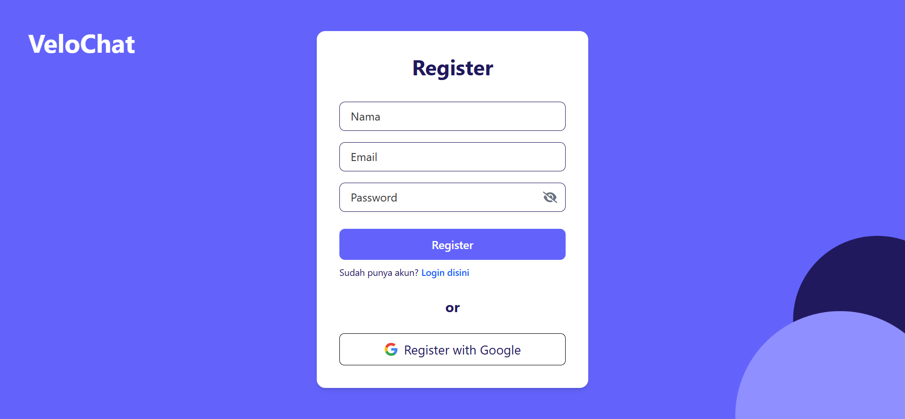
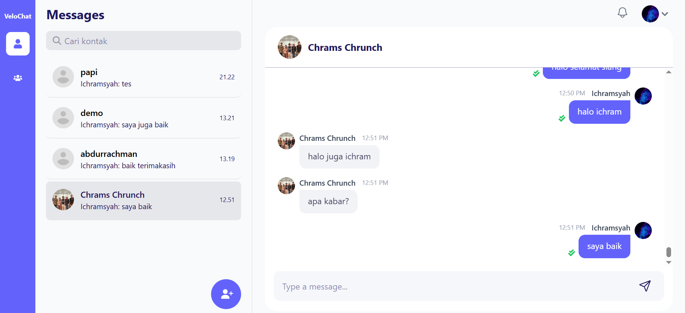
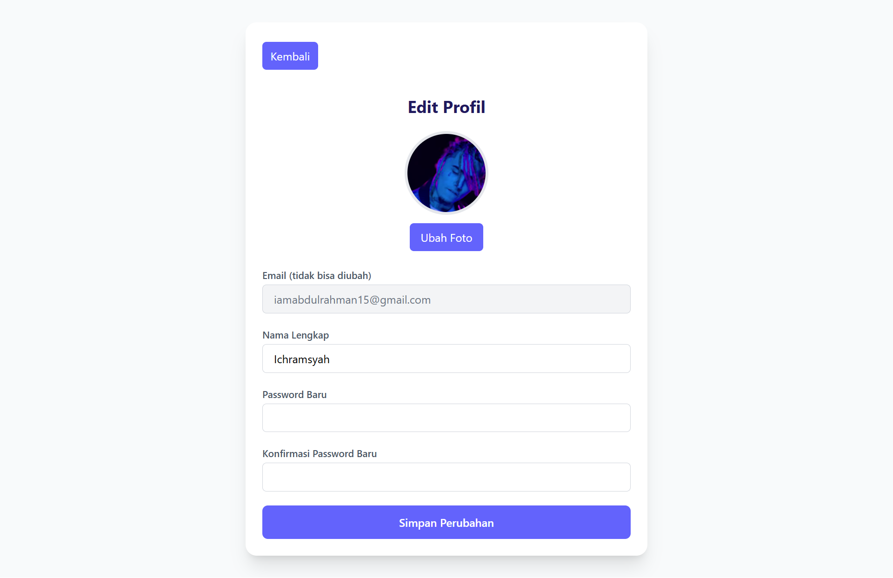
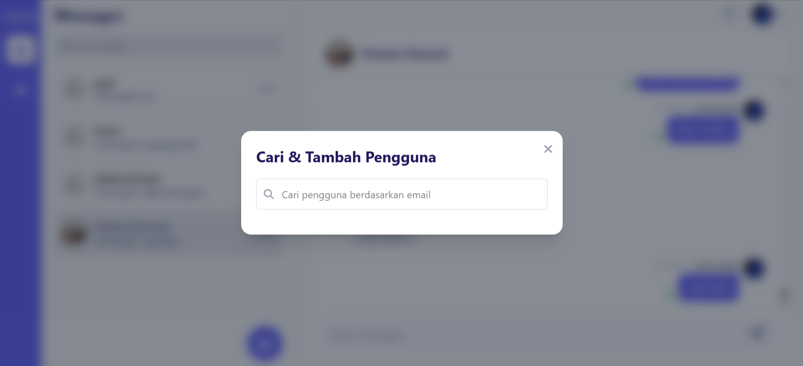

# VeloChat - Frontend ⚛️

[](https://react.dev/)
[](https://vitejs.dev/)
[](https://tailwindcss.com/)
[](https://zustand-bear.pmnd.rs/)
[](https://axios-http.com/)
[](https://socket.io/docs/v4/client-api/)
[](https://developers.google.com/identity/oauth2/web/guides/use-token-model)
[](https://react-hot-toast.com/)
[](https://www.npmjs.com/package/react-loading-skeleton)
[](https://date-fns.org/)

[README.md](README-en.md) English Ver.

Selamat datang di direktori frontend untuk aplikasi VeloChat. Bagian ini bertanggung jawab atas semua antarmuka pengguna (UI) dan pengalaman interaksi (UX) yang dilihat dan digunakan oleh pengguna. Aplikasi ini dibangun sebagai **Single-Page Application (SPA)** menggunakan **React** dan **Vite** untuk memastikan proses pengembangan yang cepat serta hasil build yang optimal.

## Daftar Isi

- [Fitur Utama Frontend](#fitur-utama-frontend)
- [Teknologi yang Digunakan](#teknologi-yang-digunakan)
- [Konsep yang Diterapkan](#konsep-yang-diterapkan)
- [Struktur Proyek](#struktur-proyek)
- [Setup Variabel Environment](#setup-variabel-environment-env)
- [Instalasi & Menjalankan](#instalasi--menjalankan)
- [Deployment](#deployment)
- [Tangkapan Layar](#tangkapan-layar)
- [Kontribusi](#kontribusi)
- [Troubleshooting](#troubleshooting)
- [Lisensi](#lisensi)

## Fitur Utama Frontend

- **Antarmuka Autentikasi:** Menyediakan halaman Login dan Register dengan validasi input, serta tombol untuk "Login dengan Google".
- **Halaman Chat Utama:** Layout dua kolom yang responsif, menampilkan daftar percakapan di satu sisi dan area chat aktif di sisi lain, dengan dukungan mobile-friendly.
- **Manajemen Pertemanan:**
  - Modal pop-up untuk mencari pengguna baru berdasarkan email dengan mekanisme debounce untuk optimasi pencarian.
  - Tombol untuk mengirim permintaan pertemanan.
  - Popover notifikasi untuk menampilkan daftar permintaan pertemanan yang masuk, lengkap dengan tombol "Terima" dan "Tolak".
- **Interaksi Chat Real-time:**
  - Menampilkan pesan baru secara instan tanpa perlu me-refresh halaman.
  - Menampilkan dan menyembunyikan indikator "typing..." secara akurat.
  - Menampilkan badge notifikasi pada percakapan dengan pesan yang belum dibaca.
  - Menampilkan status pesan (terkirim/dilihat) secara real-time.
- **Manajemen Profil:**
  - Halaman khusus bagi pengguna untuk mengubah nama dan password.
  - Antarmuka untuk memilih, melihat pratinjau, dan mengunggah foto profil baru.
- **Pengalaman Pengguna (UX):**
  - Penggunaan notifikasi **Toast** untuk feedback (sukses/error).
  - Penggunaan **Skeleton Loaders** saat memuat data untuk pengalaman yang lebih mulus.
  - Routing yang terproteksi, memastikan hanya pengguna terautentikasi yang dapat mengakses halaman utama.

## Teknologi yang Digunakan

- **Framework Inti:** [**React**](https://reactjs.org/) (dengan Vite)
- **Routing:** [**React Router DOM**](https://reactrouter.com/)
- **Styling:** [**Tailwind CSS**](https://tailwindcss.com/)
- **State Management:** [**Zustand**](https://github.com/pmndrs/zustand)
- **Komunikasi & Data:** [**Axios**](https://axios-http.com/), [**Socket.IO Client**](https://socket.io/)
- **Autentikasi:** [**@react-oauth/google**](https://www.npmjs.com/package/@react-oauth/google)
- **UI & UX:** [**React Hot Toast**](https://react-hot-toast.com/), [**React Loading Skeleton**](https://www.npmjs.com/package/react-loading-skeleton)
- **Utilitas:** [**date-fns**](https://date-fns.org/)

## Konsep yang Diterapkan

- **Component-Based Architecture:** Membangun UI dari komponen-komponen yang dapat digunakan kembali dan terisolasi (contoh: `Header`, `ChatBox`, `SearchModal`).
- **Single-Page Application (SPA):** Menggunakan React Router untuk navigasi di sisi klien, menciptakan pengalaman yang cepat tanpa me-refresh halaman secara penuh.
- **State Management Terpusat:** Memanfaatkan Zustand untuk mengelola state global seperti informasi pengguna (`userStore`) dan data chat (`chatStore`), sehingga data mudah diakses dari komponen manapun.
- **React Hooks:** Penggunaan ekstensif dari hook seperti `useState`, `useEffect`, `useCallback`, dan `useRef` untuk mengelola state lokal, side effects (seperti panggilan API dan listener socket), dan memoization.
- **"Lifting State Up" Pattern:** Memusatkan state dan logika yang kompleks (seperti koneksi socket dan daftar chat) di komponen induk (`ChatPage`) dan meneruskannya ke komponen anak sebagai props.
- **Asynchronous Operations:** Menangani panggilan API dan operasi yang memakan waktu menggunakan sintaks `async/await` untuk kode yang lebih bersih.
- **Protected Routes:** Menerapkan komponen pembungkus (`ProtectedRoute`, `PublicRoute`) untuk mengatur hak akses ke halaman tertentu berdasarkan status autentikasi pengguna.
- **Debouncing:** Mengimplementasikan debounce pada fungsi pencarian kontak untuk mengurangi jumlah panggilan API dan meningkatkan performa aplikasi dengan menunda eksekusi hingga pengguna selesai mengetik (delay 300ms).

## Struktur Proyek

Struktur folder utama di dalam `/src` diatur sebagai berikut:

```
/frontend
└── /src
    ├── /api             # Fungsi terpusat untuk interaksi dengan API backend
    ├── /components      # Komponen UI yang bisa dipakai ulang dan biasanya tidak memiliki state aplikasi yang kompleks
    |    ├── /auth       # Komponen terkait otentikasi (Login, Register)
    |    ├── /chat       # Komponen spesifik untuk fungsionalitas chat (ChatBox, MyChats)
    |    ├── /common     # Komponen umum yang digunakan di banyak tempat (Button, Modal)
    |    └── /ui         # Komponen tingkat rendah yang fokus pada elemen visual dasar dan styling
    ├── /layouts         # Komponen tata letak (layout) yang mendefinisikan struktur halaman umum aplikasi (MainLayout)
    ├── /pages           # Komponen utama yang berfungsi sebagai halaman terpisah dalam aplikasi (ChatPage, ProfilePage)
    ├── /store           # Konfigurasi state management global, tempat di mana mendefinisikan 'slices' atau 'modules' untuk state aplikasi (userStore, chatStore)
    ├── /utils           # Kumpulan fungsi utilitas atau helper yang tidak terikat pada komponen atau fitur tertentu (chatUtils)
    └── main.jsx         # Titik masuk utama aplikasi, tempat melakukan rendering root React, konfigurasi routing, dan menyediakan provider global
```

## Setup Variabel Environment (`.env`)

Buat sebuah file bernama `.env` di dalam direktori root `/frontend`. File ini dibutuhkan untuk menyimpan Client ID Google yang bersifat publik.

Isi file `.env` dengan variabel berikut:

```env
# Ganti dengan Client ID dari Google Cloud Platform Anda
VITE_GOOGLE_CLIENT_ID=xxxxxxxx.apps.googleusercontent.com
```

**Catatan:** Pastikan untuk menambahkan file `.env` ke `.gitignore` agar tidak diunggah ke repositori publik.

## Instalasi & Menjalankan

1. **Navigasi ke Folder**
   Dari direktori root proyek, masuk ke folder frontend:

   ```bash
   cd frontend
   ```

2. **Install Dependensi**

   ```bash
   npm install
   ```

3. **Jalankan Server Development**
   ```bash
   npm run dev
   ```
   Aplikasi akan berjalan di **http://localhost:5173** (atau port lain jika 5173 sudah terpakai).

### Skrip yang Tersedia

- `npm run dev`: Menjalankan aplikasi dalam mode development dengan hot reloading.
- `npm run build`: Mem-build aplikasi untuk mode produksi ke dalam folder `/dist`.
- `npm run preview`: Menjalankan hasil build produksi secara lokal untuk pengujian.

## Deployment

Untuk deployment frontend ke lingkungan produksi, langkah-langkah berikut dapat diikuti:

1. **Build Proyek**
   Jalankan `npm run build` untuk menghasilkan file produksi di folder `/dist`.

2. **Deploy ke Platform Hosting**

   - Gunakan **Vercel** untuk deployment yang cepat dan otomatis:
     - Hubungkan repository Git Anda ke Vercel.
     - Konfigurasi variabel lingkungan (`VITE_GOOGLE_CLIENT_ID`) di dashboard Vercel.
     - Deploy dengan klik "Deploy".
   - Alternatif: Gunakan **Netlify** atau **GitHub Pages** dengan konfigurasi serupa.

3. **Periksa Deployment**
   Setelah deployment selesai, pastikan URL deployment diuji dengan backend yang sudah berjalan (misalnya, di Railway).

**Catatan:** Pastikan backend (Node.js/Express) sudah dideploy dan URL-nya dikonfigurasi dengan benar di frontend (misalnya, melalui Axios baseURL).

## Tangkapan Layar

**Halaman Login**



**Halaman Register**



**Halaman Utama**



**Halaman Profile**



**Halaman Pencaian Kontak**



## Kontribusi

Kami sangat menyambut kontribusi dari komunitas! Untuk berkontribusi pada frontend VeloChat, ikuti langkah-langkah berikut:

1. **Fork Repository**
   Fork repositori ini di GitHub.

2. **Clone Repository**

   ```bash
   git clone https://github.com/<your-username>/velochat-fullstack-webApp.git
   cd frontend
   ```

3. **Buat Branch Baru**

   ```bash
   git checkout -b feature/nama-fitur-anda
   ```

4. **Install Dependensi dan Kerjakan Perubahan**

   ```bash
   npm install
   npm run dev
   ```

   Lakukan perubahan kode Anda dan uji secara lokal.

5. **Commit dan Push**

   ```bash
   git commit -m "Tambahkan fitur/nama-fitur-anda"
   git push origin feature/nama-fitur-anda
   ```

6. **Buat Pull Request**
   Buka Pull Request di repositori utama dan jelaskan perubahan Anda secara detail.

### Panduan Kode

- Ikuti [Kode Etik](https://github.com/ichramsyah/velochat-fullstack-webApp/blob/main/CODE_OF_CONDUCT.md).
- Gunakan gaya penulisan konsisten dengan ESLint dan Prettier (konfigurasi sudah disertakan).
- Tambahkan dokumentasi untuk fitur baru di README atau kode yang relevan.

### Ide Kontribusi

- Tambahkan dukungan untuk grup chat.
- Integrasikan fitur berbagi file (gambar, dokumen).
- Tingkatkan responsivitas UI untuk layar kecil.
- Tambahkan animasi transisi untuk pengalaman yang lebih halus.

## Troubleshooting

- **Error: "VITE_GOOGLE_CLIENT_ID is undefined"**
  - Pastikan file `.env` telah dibuat dan variabel `VITE_GOOGLE_CLIENT_ID` diisi dengan benar. Restart server development setelah mengubah `.env`.
- **Koneksi Socket.IO Gagal**
  - Verifikasi bahwa backend berjalan di `http://localhost:5000` atau sesuaikan `ENDPOINT` di `ChatPage.jsx` dengan URL backend Anda.
- **Build Gagal**
  - Hapus folder `node_modules` dan `package-lock.json`, lalu jalankan `npm install` kembali.
- **Notifikasi Tidak Muncul**
  - Pastikan socket terhubung dengan benar dan event listener diatur dengan tepat di `Header.jsx` dan `ChatBox.jsx`.

Jika masalah berlanjut, buka issue di GitHub atau hubungi [ichramsyahabdurrachman@gmail.com](mailto:ichramsyahabdurrachman@gmail.com).

## Lisensi

Proyek ini dilisensikan di bawah [Lisensi MIT](https://github.com/ichramsyah/velochat-fullstack-webApp/blob/main/LICENSE). Anda bebas menggunakan, menyalin, memodifikasi, menggabungkan, menerbitkan, mendistribusikan, mensublisensikan, dan/atau menjual salinan perangkat lunak ini, dengan syarat menyertakan pemberitahuan hak cipta dan izin ini dalam semua salinan atau bagian penting dari perangkat lunak.

Untuk pertanyaan lebih lanjut, silakan hubungi [Ichramsyah Abdurrachman](mailto:ichramsyahabdurrachman@gmail.com).
